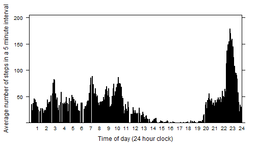
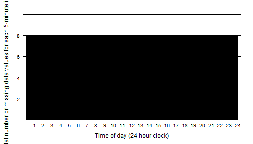
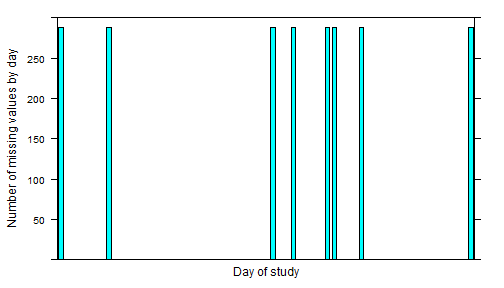
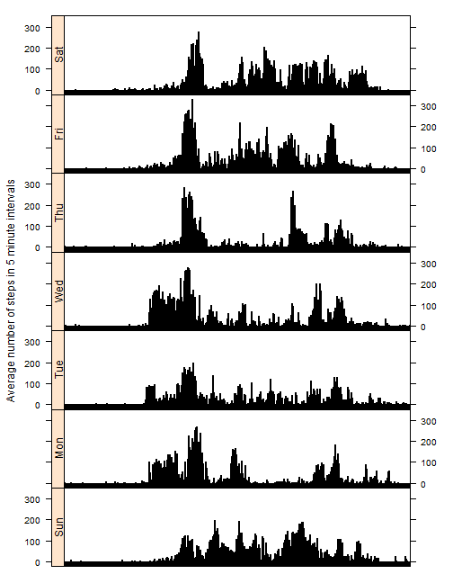

# Reproducible Research: Peer Assessment 1

## Loading and preprocessing the data

Unzipping activity.zip


```r
activity <- read.csv(unz("activity.zip","activity.csv"))
str(activity)
```

```
## 'data.frame':	17568 obs. of  3 variables:
##  $ steps   : int  NA NA NA NA NA NA NA NA NA NA ...
##  $ date    : Factor w/ 61 levels "2012-10-01","2012-10-02",..: 1 1 1 1 1 1 1 1 1 1 ...
##  $ interval: int  0 5 10 15 20 25 30 35 40 45 ...
```

```r
summary(activity)
```

```
##      steps                date          interval     
##  Min.   :  0.00   2012-10-01:  288   Min.   :   0.0  
##  1st Qu.:  0.00   2012-10-02:  288   1st Qu.: 588.8  
##  Median :  0.00   2012-10-03:  288   Median :1177.5  
##  Mean   : 37.38   2012-10-04:  288   Mean   :1177.5  
##  3rd Qu.: 12.00   2012-10-05:  288   3rd Qu.:1766.2  
##  Max.   :806.00   2012-10-06:  288   Max.   :2355.0  
##  NA's   :2304     (Other)   :15840
```

## What is mean total number of steps taken per day?

The `xtabs` function can be used to determine the total number of steps taken per day 

```r
tb <- xtabs(steps ~ date,activity)
head(tb,8)
```

```
## date
## 2012-10-01 2012-10-02 2012-10-03 2012-10-04 2012-10-05 2012-10-06 
##          0        126      11352      12116      13294      15420 
## 2012-10-07 2012-10-08 
##      11015          0
```

```r
tail(tb,8)
```

```
## date
## 2012-11-23 2012-11-24 2012-11-25 2012-11-26 2012-11-27 2012-11-28 
##      21194      14478      11834      11162      13646      10183 
## 2012-11-29 2012-11-30 
##       7047          0
```

```r
mean(tb)
```

```
## [1] 9354.23
```
Just to check that the total number of steps per day are being calculated correctly, we sum the steps for 2012-11-24 explicitly

```r
sum(subset(activity,date == "2012-11-24")$steps)
```

```
## [1] 14478
```

The mean number of steps taken per day is 9354.2295082.

## What is the average daily activity pattern?

The daily pattern is determined by the interval.

```r
avg <- xtabs(steps ~ interval,activity)/xtabs(~interval,activity)
summary(as.numeric(avg))
```

```
##    Min. 1st Qu.  Median    Mean 3rd Qu.    Max. 
##    0.00    2.16   29.64   32.48   45.91  179.10
```
To plot these averages over 5 minute periods in the day I use the `lattice` package

```r
library(lattice)
barchart(avg ~ names(avg),xlab="Time of day (24 hour clock)",ylab="Average number of steps in a 5 minute interval",ylim=c(0,205.),scales=list(x=list(at=seq(0,288,by=12),labels=c(0:24))))
```



## Imputing missing data

As shown in the summary of the `activity` data frame, there are 2304 missing values for the `steps` variable in a total of 17568 observations, a missing data rate of 13.11%. That is quite a large portion of the data to impute.

We first check the distribution of the missing data by interval

```r
miss <- xtabs(is.na(steps) ~ interval, activity)
barchart(miss ~ names(miss),xlab="Time of day (24 hour clock)",ylab="Total number or missing data values for each 5-minute interval",ylim=c(0,10),scales=list(x=list(at=seq(0,288,by=12),labels=c(0:24))))
```



The consistency of the number of missing values is remarkable.

Next we consider the distribution throughout the days of the study.

```r
missbyday <- xtabs(is.na(steps) ~ date, activity)
barchart(missbyday ~ names(missbyday),xlab = "Day of study",
         ylab="Number of missing values by day",ylim=c(0,300),scales=list(x=list(draw=FALSE)))
```



So apparently all the data for 8 of the 61 days of observation is missing, which explains the consistency of the number of missing data per time interval.

To impute values for one of these days we first consider what day of the week it is.  This can be done by converting the `date` to the `POSIXlt` type using `strptime` and extracting the `wday` component


```r
activity$wday <- factor(strptime(activity$date,"%Y-%m-%d")$wday,
                        labels=c("Sun","Mon","Tue","Wed","Thu","Fri","Sat"))
days <- unique(subset(within(activity,{NAs <- is.na(steps)}),select = c(date,wday,NAs)))
```

The days with missing data are

```r
subset(days,NAs,select=-NAs)
```

```
##             date wday
## 1     2012-10-01  Mon
## 2017  2012-10-08  Mon
## 8929  2012-11-01  Thu
## 9793  2012-11-04  Sun
## 11233 2012-11-09  Fri
## 11521 2012-11-10  Sat
## 12673 2012-11-14  Wed
## 17281 2012-11-30  Fri
```

## Are there differences in activity patterns between weekdays and weekends?

Merging the day-of-week information into `activity` and determine the average number of steps by `interval` and `wday` for the non-missing data only. This will help to separate week from week-end datas.


```r
activity <- merge(activity,days)
actnonmiss <- na.omit(activity)
avgintday <- xtabs(steps ~ interval+wday,actnonmiss)/xtabs(~interval+wday,actnonmiss)
dfrm <- as.data.frame(avgintday)
barchart(Freq ~ interval|wday,dfrm,layout=c(1,7),strip=FALSE,strip.left=TRUE,
         ylab="Average number of steps in 5 minute intervals",xlab=NULL,
         scales=list(x=list(draw=FALSE)))
```


